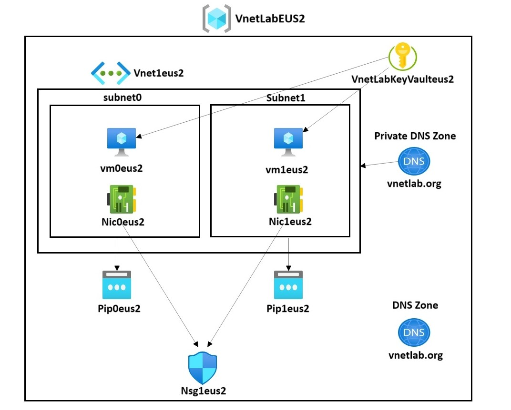

# Implement Virtual Networking Lab

This is a lab of implementing a basic virtual network architecture to Azure through Infrastructure as Code using a combination of bicep and powershell.

## Resources Used

-Virtual Network
-Azure Key Vault
-Network Security Groups
-Virtual Machines
-DNS Zone
-Private DNS Zone

## Blog Post

If you would like to read a deep dive of this lab build, I have documented the entire lab and process in detail on my [DevTo] blog post.